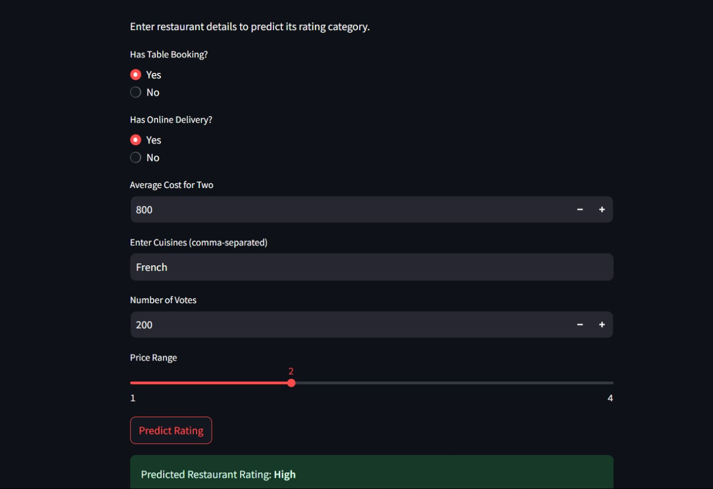

🍽 Restaurant Rating Prediction - ML Model

🖼 Project Screenshot 

📌 A Machine Learning-based project to predict restaurant ratings based on various features.

This project is part of the Cognifyz Internship Program, where the task was to build a restaurant rating prediction model using machine learning. The dataset was provided by Cognifyz, and the objective was to train a model to predict ratings accurately based on key restaurant parameters.

🚀 Workflow

⿡ Exploratory Data Analysis (EDA) 📊

🔹 Understanding the dataset

🔹 Generating insights and patterns

🔹 Visualizing key relationships

⿢ Data Preprocessing & Feature Engineering 🔧

🔹 Handling missing values

🔹 Encoding categorical features

🔹 Feature selection and extraction

⿣ Model Development & Optimization 🤖

🔹 Splitting the dataset into training and testing sets

🔹 Testing multiple classification models

🔹 Hyperparameter tuning (Accuracy improved from 63% → 85% 🚀)

⿤ Deployment with Streamlit 🌐

🔹 Building an interactive UI with Streamlit

🔹 Allowing users to input restaurant details & get predicted ratings

📊 Dataset Details

The dataset includes various restaurant-related attributes such as:

✅ Table Booking Availability (Yes/No)

✅ Online Delivery Option (Yes/No)

✅ Average Cost for Two People (Numerical)

✅ Cuisines Offered (Text)

✅ Price Range (Categorical)

✅ Number of Votes Received (Numerical)

🏗 Project Structure

📂 Restaurant-Rating-Predictor

├── 📂 datasets/ → Dataset files

├── 📂 models/ → Trained ML models

├── 📂 EDA_Outputs/ → HTML reports of EDA

├── 📜 app.py → Streamlit application

├── 📜 model_training.ipynb → Jupyter Notebook for model training

├── 📜 requirements.txt → Dependencies file

└── 📜 README.md → Project documentation

🖥 Running the Project

✅ 1. Install Dependencies
Make sure Python is installed, then run:

pip install -r requirements.txt

✅ 2. Run the Streamlit Application

    streamlit run app.py

    
📌 Key Features

✔ 85% Accuracy with optimized model

✔ Interactive UI using Streamlit

✔ Well-documented EDA & model training steps

✔ Deployed for real-time predictions

🔮 Future Enhancements

🚀 Improve accuracy further using Deep Learning techniques

🚀 Expand dataset with additional features (e.g., customer reviews, location details)

🚀 Deploy the application on cloud platforms like AWS/GCP

🏆 Contribution

Want to contribute? 🤝

Feel free to fork the repo, create a new branch, and submit a pull request. If you encounter any bugs or have suggestions, raise an issue.

📢 Contact
📩 Email: abhinavg963@gmail.com

🔗 LinkedIn: [Abhinav Gupta](https://www.linkedin.com/in/abhinav-gupta-34a1b2349)

⭐ If you find this project useful, don't forget to star the repo!
